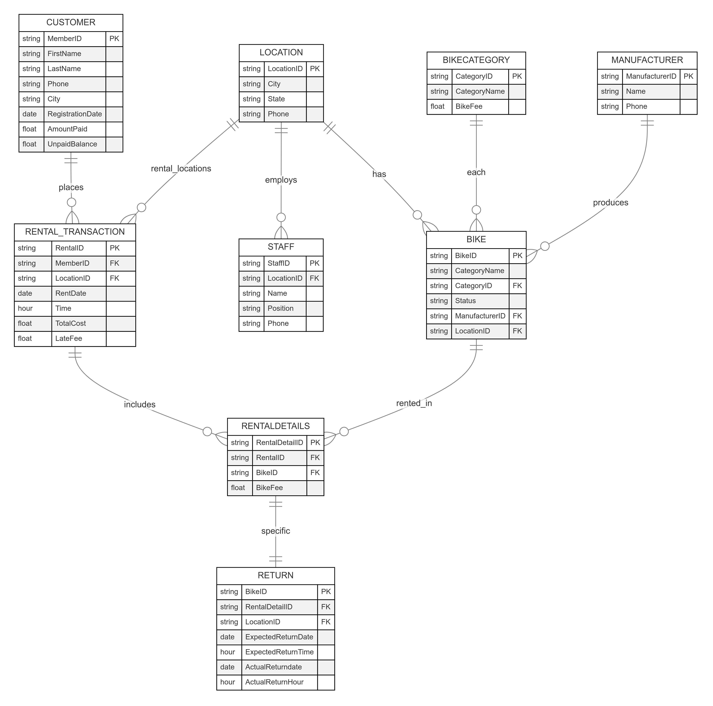

# Bike Rental Database Management System

### Objective
This academic project was developed to design, implement, and demonstrate a relational database management system for a bike rental company.  
The goal was to apply database design principles, SQL programming, and business logic automation using triggers and constraints.

---

### Database Design
The database was designed using Oracle SQL and includes eight core tables:
**CUSTOMER, LOCATION, STAFF, BIKECATEGORY, MANUFACTURER, BIKE, RENTAL_TRANSACTION, RENTALDETAILS, RETURN**.

The schema supports customer registration, bike rentals and returns, late fee calculation, and staff management across multiple rental locations.

---

### Key Components

#### Tables & Relationships
- Defined primary and foreign keys to maintain referential integrity.
- Designed relationships such as:
  - *Customer–RentalTransaction (1-to-many)*
  - *Bike–RentalDetails (1-to-many)*
  - *Manufacturer–Bike (1-to-many)*
  - *RentalDetails–Return (1-to-1)*

#### Triggers Implemented
- **LimitBikeRentals:** Prevents customers from renting more than three bikes simultaneously.  
- **HandleLateReturn:** Calculates late fees automatically and updates the customer’s unpaid balance.  
- **CheckUnpaidBalance:** Restricts new rentals for customers with unpaid balances over $500.  

#### Data Operations
Inserted sample records for all tables, tested joins and integrity constraints, and validated business logic using test cases.

---

### SQL Script
The full database schema and triggers can be found in the script file:  
[Final Database Script.rtf](./Final%20Database%20Script%20.rtf)

---

### Tools & Technologies
- **Database:** Oracle SQL  
- **Modeling:** Lucidchart and Mermaid (ER Diagram)  
- **Interface:** HTML, JavaScript, React, CSS for front-end and Python for back-end
- **Versioning:** GitHub  

---

### User Interface Prototype
Prototype forms were created to simulate interactions such as:
- Customer registration  
- Bike rentals and returns  
- Late fee updates and balance checks  

---

### Results
The database successfully:
- Enforced business logic via triggers and constraints.  
- Automated updates for late returns and balances.  
- Demonstrated relational integrity through normalized schema and dependency rules.  

---

### Key Learnings
- Practiced **data normalization, referential integrity, and transaction control**.  
- Developed comfort with **SQL functions, triggers, and stored procedures**.  
- Learned to map **real-world processes to relational models**.

---

### Authors
Ashmita Neupane • Komi Agodongo • Leroy Mukirisu  
*(Project completed for IS 443/543 — Spring 2025 at St. Cloud State University)*

---

